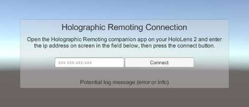
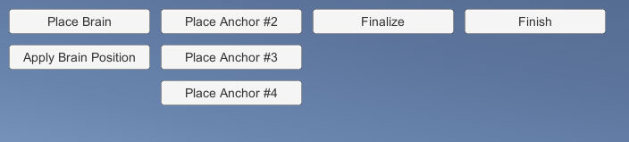
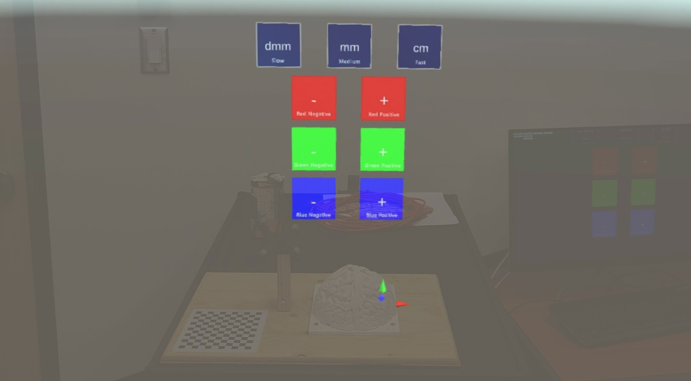

# Brain Positionning Prototype

**Prérequis**
 - HoloLens 2
 - L'application « Holographic Remoting Player » installée sur l'HoloLens

## Guide d'utilisation

**Connexion**
Les étapes suivantes permettent d'établir la connexion via Holographic Remoting entre le PC et l'HoloLens.

 1. D'abord s'assurer que les deux appareils sont connectés au même réseau.
 2. Lancer l'application Holographic Remoting Player sur l'HoloLens et prendre note de l'adresse IP qui y est affichée.
 3. Entrer l'adresse IP telle quelle dans le champ approprié sur l'application PC

**Menu de l'application PC**
Lorsque la connexion en Holographic Remoting est établie, les options suivantes sont disponibles sur l'applicaiton du PC:

Utilisation de l'interface:
 - **Place Brain.** Rends l'objet virtuel du cerveau déplaçable à l'aide des mains et du pincement des doigts. L'utilisateur est encouragé à positionner le modèle du cerveau approximativement à l'endroit désiré. L'étape de placement des ancres permettra d'effectuer un positionnement plus précis.
 - **Apply Brain Position.** Indique aux éléments UI dans l'HoloLens la nouvelle position du modèle virtuel du cerveau. Permet de déplacer ces éléments afin qu'ils soient positionnés relativement au cerveau.
 - **Place Anchor #n.** Affiche et ouvre l'interface pour le positionnement d'un ancre. Les manipulations à l'intérieur de l'HoloLens sont décrites à la section suivante.
 - **Finalize.** Effectue le calcul de positionnement final du cerveau et l'affiche à sa nouvelle position.
 - **Finish.** Cache ce menu et les boutons
 - **Disconnect.** Défait la connexion par Holographic Remoting entre le PC et l'HoloLens.
 - **X.** Quitte l'application

**Manipulation dans l'HoloLens**
Lors de l'étape Place Brain, l'utilisateur peut déplacer et appliquer une rotation au modèle virtuel du cerveau. Pour le sélectionner, il suffit d'utilise le pincement du pouce et de l'index. Tant que ceux-si sont maintenus, l'objet est considéré aggripé par la main de l'utilisateur. On peut utiliser les deux main pour le déplacement. À noter que la zone de sélection du cerveau (hitbox) est à peu près 1.5 fois plus grande que le modèle lui-même.

Lors de l'étape Place Anchor, l'interface suivant apparait.

Utilisation de l'interface:
 - **dmm (slow)**: Sélectionne la vitesse de translation lente (décimilimètre)
 - **mm (medium)**: Sélectionne la vitesse de translation moyenne (milimètre)
 - **cm (fast)**: Sélectionne la vitesse de translation rapire (centimètre)
 - **-**: Effectue une translation négative le long de l'axe correspondant avec la couleur du bouton
 - **+**: Effectue une translation positive le long de l'axe correspondant avec la couleur du bouton

L'image suivante présente l'ancre (sphère magenta) et les axes de couleur correspondant avec les boutons de déplacement. L'objectif de cette étape est d'aligner le mieux possible les ancres virtuels à leurs homologues réels sur la version imprimée du cerveau.

**Debug**
Deux options pour le debugging sont disponibles. On peut les activer ou les activer directement dans hiérarchie de la scène `Main`, sous l'objet nommé `GameManager`. On y retrouve deux scripts:
 - `Game Manager`: l'option Debug, lorsque vrai, affichera le profiler dans l'HoloLens. Celui-ci permet entre autres de visualiser le framerate et la mémoire utilisée.
 - `Console Debugger`: l'option Active, lorsque vrai, affichera sur l'application exécutable un interface pour la même console que l'on retrouve dans l'éditeur. Cela permet de voir les messages d'erreurs et d'information.
